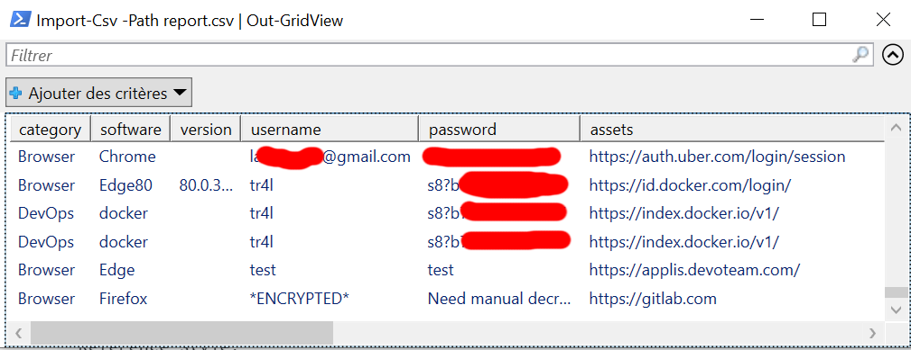

# MULTIPASS

**`Multipass`** est un outils de récupération de credentials sur un ordinateur client cible.

Pour limiter la détéction de l'outils par la cible, une approche client/server a été retenu ici.

Plusieurs clients peuvent donc s'occuper de la collecte de données "brute", pendant que le serveur s'occuperas de les traiter.

Pour la release initial, seul un client `powershell` est disponible.

## Serveur
Le serveur s'occupe de la génération des clients, ainsi que du traitement des données récupéré par le client.
### Installation 
Apres avoir cloner le projet il vous faudras:
- Installer nodejs 12.xx 
- Recuperer les dependances: ```npm install```
- Le serveur devrais être opérationnel

### Utilisation
Une fois vos données récupéré depuis le client, plaçez les dans le dossiers "c:\dev\temp\out\" puis executer la commande: ```node report.js```
Cela génere un CSV avec un résumé des credentials récupéré.

Pour les voir rapidement (avec powershell):
```Import-Csv -Path report.csv | Out-GridView```



## Client
### Powershell
Le client powershell ce build de la façon suivante:
- ```npm run powershell```

La commande devrais avoir executé un fichier multipass.ps1 à executer sur la machine cible.

Pour chaque module le fichier executer va créer un JSON **dans le dossier courant** et eventulement des fichiers. Ces données sont à fournir au serveur.

## Module
Les modules suivants sont implémenté:

### Invoke-MultiPassChrome
Fonctionne à partir de la version 80 de Chrome
- Extrait la master clef du fichier JSON  ```%LOCALAPPDATA%\Google\Chrome\User Data\Local State``` contenu dans os_crypt.encrypted_key
- Demande à la DPAPI de décoder la clef (droit utilisateur)
- Récupère tout les fichiers "Login Data" (base de donnée SQLITE) de tous les profile.

Coté serveur:
- On liste tous les login/password de la base de donnée: ```SELECT action_url as url, username_value as user , password_value as password FROM logins```
- On decrypte (AES-256-GCM) les passwords avec la master clef.

### Invoke-MultiPassEdge80
Tout pareil.

### Invoke-MultiPassEdge
Récupère les credentials dans le Windows.Security.Credentials.PasswordVault
Fonctionne avec la dernière version 44 de Edge (par defaut sous windows 10)

### Invoke-MultiPassMaven
Coté client, récupère les fichiers:
- .m2/settings.xml
- .m2/settings-security.xml

Coté serveur, si les settings sont protégé par une clef maitre il faudras utilisé  [MavenDecoder](https://github.com/tr4l/misc/tree/master/MavenDecoder) manuellement.

### Invoke-MultiPassCredMan
Basé sur un module empire [dumpCredStore.ps1](https://github.com/BC-SECURITY/Empire/blob/master/data/module_source/credentials/dumpCredStore.ps1)
Le client récupère les credentials et encode le CredBlog en base64 pour ne pas perdre d'informations.

### Invoke-MultiPassDocker
Basé sur le module [dockerpass](https://gitlab.audit/tlarouanne/redvoteamhelpers/tree/master/Credential%20Access/dockerpass)
Le client récupère les credentials docker, et les renvoie.

### Invoke-MultiPassFireFox
Le client recupère les fichiers key4.db et login.json de chaque profile identifié.

Coté serveur il faut lancer Firefox pour pouvoir visualiser les password du profile "Profile0"
```
PS :> $profile = "Profile0"
PS :> mkdir $profile
PS :> cp .\Browser_FireFox_${profile}_key4.db $profile\key4.db
PS :> cp .\Browser_FireFox_${profile}_logins.json $profile\logins.json
PS :> cd $profile
PS :> & "C:\Program Files\Mozilla Firefox\firefox.exe" -profile . "about:logins"
```
## Developement
### Module
Comme le fichier peut etre compliqué à généré et potentielement long à executer voici quelque astuce pour travailler sur un modules en particulier

Les fichier de module, utils et core doivent être du powershell valide. Pour ce faire il faut limiter l'usage des commandes de templating et les mettre en commentaire powershell. Par exemple:
```
# Add utils dependencies
# <% utils.add("Get-IniContent.ps1") %>
```

Ce qui permet de pouvoir lancer un module de façon unitaire de la façon suivante:
```
C:\<path>\client\powershell>powershell -executionPolicy ByPass
Windows PowerShell
Copyright (C) Microsoft Corporation. Tous droits réservés.

# Loading the MultiPassExport class used to format result
PS C:\<path>\client\powershell> . .\core\MultiPassExport.ps1
# Loading dependencies
PS C:\<path>\client\powershell> . .\utils\Get-IniContent.ps1
# Loading the module you are working with
PS C:\<path>\client\powershell> . .\modules\Invoke-MultiPassFireFox.ps1
# Call the module
PS C:\<path>\client\powershell> Invoke-MultiPassFireFox | ConvertTo-JSON
```
Vous pouvez ensuite répéter les 2 dernières lignes jusqu'à être satisfait du résultat.

### Ajouter un module
Pour ajouter un module coté client il suffit d'ajouter le fichier dans le dossier modules en suivant cette convention:
- Invoke-MultiPass<nom_du_module>.ps1
- Le nom de la fonction principal doit être Invoke-MultiPass<nom_du_module>
- La fonction principal doit retourner un objet de type MultiPassExport
Voici un court exemple:
```
# Add utils dependencies
# <% utils.add("MyUtils.ps1") %>
# Add assembly dependencies
# <% assembly.add("System.Security") %>

function Invoke-MultiPassMyModule {
    $export = New-Object MultiPassExport
    $export.category = "Debug"
    $export.software = "MyModule"
    $export.data["profile:admin:username"] = "administrateur"
    $export.data["profile:admin:password"] = "p4ssw0rD!"
    # This will copy the file c:\.hidden\creds.txt to the local folder under the name Debug_MyModule_admin_creds
    # Try to make the name unique.
    $export.files["Debug_MyModule_admin_creds"] = "c:\\.hidden\creds.txt"
    return $export
}
```